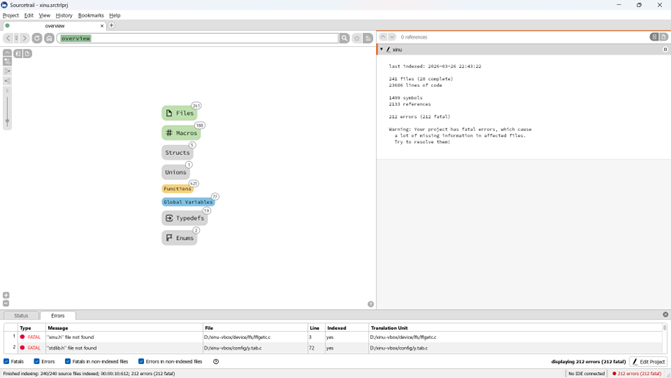
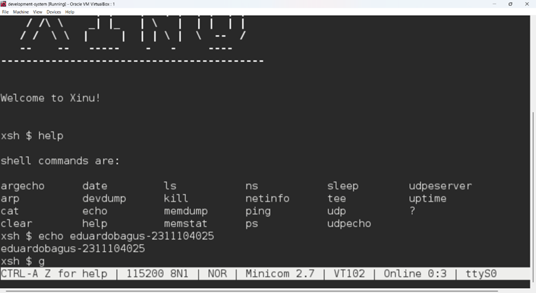

# <h1 align="center">Laporan Praktikum Modul 4   Membaca Source Code Xinu</h1>

EDUARDO BAGUS PRIMA JULIAN - 2311104025

## Dasar Teori

Instalasi Oracle VM VirtualBox dan Sourcetrail, import backend dan development system ke Virtual Box lalu coba running

## Guided

 MODUL 4

1.	[10 Poin] Apa nama image yang dihasilkan setelah melakukan kompilasi pada Xinu? Berapa ukuran file tersebut? Ada pada folder apa file image tersebut? 
Hint: baca kembali modul-modul sebelumnya
Jawab: xinu.elf, ukuran-nya sekitar 500KB hingga 1MB. Terdapat di folder compile.

2.	Membaca source code Xinu
a.	Cek aplikasi bernama Sourcetrail di PC. Jika belum ada, download SourceTrail pada (DOWNLOAD SOURCETRAIL). SourceTrail adalah software untuk mengeksplorasi source code. Programmer yang bagus lebih banyak membaca kode daripada menulis kode
b.	Download file source code xinu yang tersedia pada attempt jurnal praktikum di LMS
c.	Jalankan SourceTrail
d.	Project  New Project
e.	Isi nama project xinu dan pilih lokasi project di manapun
f.	Add Source Groups, pilih C, lalu pilih Empty C Source Group
g.	File & Directories to Index: masukkan semua folder Xinu (yang sebelumnya telah di download)
h.	Include Paths: …/xinu/include
i.	Create
j.	Silahkan eksplorasi source code Xinu
Jawab:
 

3.	[10 Poin] Carilah struktur data dari proses pada Xinu OS. Struktur data proses ada pada file apa? Informasi apa saja yang disimpan dalam struktur data tersebut? 
Hint: file berektensi .h 

Pada Linux bisa digunakan perintah “grep”
Contoh:
$ grep -r “kata_yang_ingin_dicari” /path/ke/direktori/tempat/file/berada
Jawab: Struktur data proses pada Xinu terdapat pada file header: include/process.h; Di dalam file tersebut terdapat struktur utama yang bernama struct procent (proses entry). Struktur ini digunakan untuk menyimpan informasi setiap proses. 
Informasi yang ada pada struktur data sebagai berikut: 
•	Prstate: Status proses (running, ready, sleep, dll) 
•	Prprio: Prioritas proses 
•	Prstkptr: Pointer stack proses 
•	Prstkbase: alamat awal stack 

4.	[80 poin] Mengubah welcome banner pada Xinu
a.	Carilah file yang menyimpan banner Xinu! 
Hint: file berekstensi .h pada direktori xinu/include
b.	Carilah file yang menampilkan banner Xinu!
Hint: file berektensi .c pada direktori xinu/shell
c.	Ubahlah welcome banner Xinu sehingga menjadi seperti ini:
 
Tambahkan NAMA dan NIM masing-masing, kemudian ubah banner Xinu sesuai dengan selera Anda
d.	Setelah melakukan perubahan lakukan perintah berikut ini pada terminal Linux
•	$ cd xinu/compile
•	$ make clean
•	$ make
•	$ sudo minicom
•	Jalankan vm backend
Jawab:
 

## Referensi

1. trust me bro