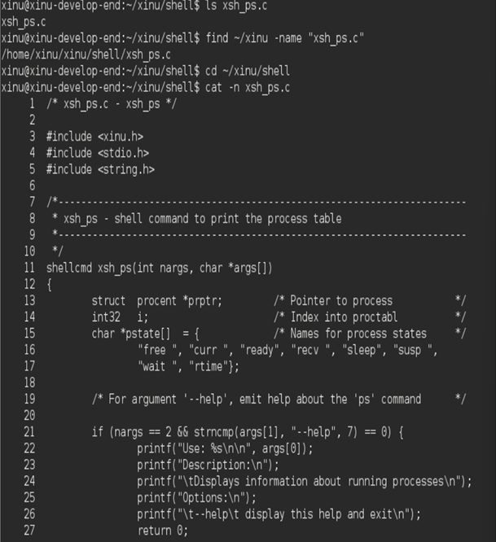
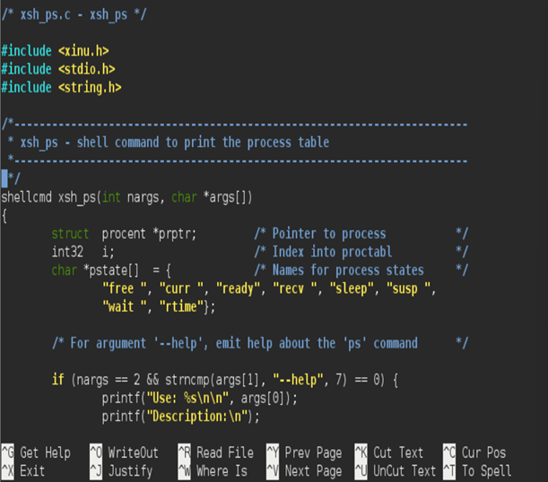
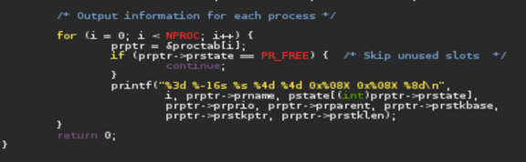
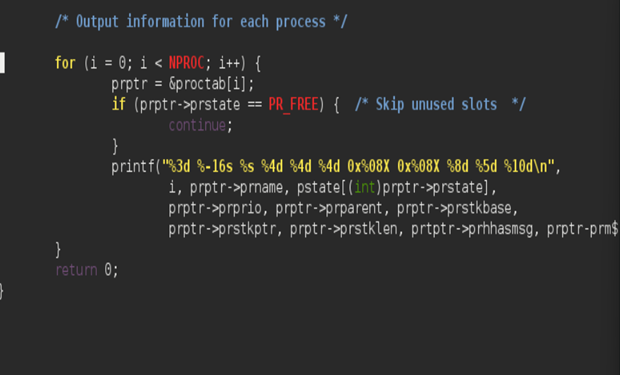
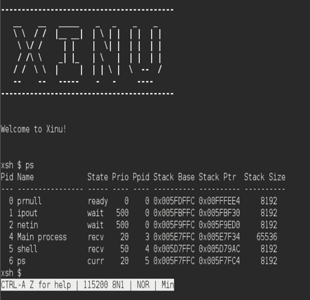
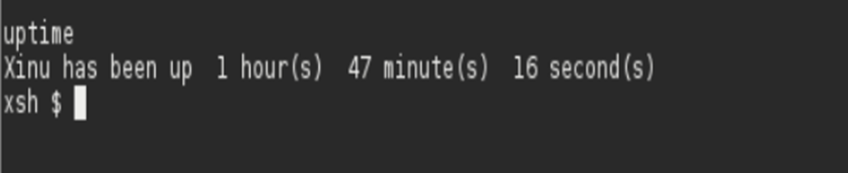

# <h1 align="center">Laporan Praktikum Modul 5   Explorasi Proses</h1>

EDUARDO BAGUS PRIMA JULIAN - 2311104025

## Dasar Teori

Instalasi Oracle VM VirtualBox dan Sourcetrail, import backend dan development system ke Virtual Box lalu coba running

## Guided

 MODUL 5

1.	[10 Poin] Jawablah pertanyaan berikut ini: 
a.	Berapa banyaknya maksimum proses yang ada pada Xinu?
b.	Berapa maksimal panjang nama suatu proses pada Xinu?
c.	Berapa nilai prioritas awal pada saat proses dibuat?
d.	Ada berapa total state pada Xinu? Sebutkan!
Jawab:
a.	Pada banyak sistem Xinu, nilainya adalah 100.
b.	Biasanya adalah 16 karakter (termasuk karakter null pemutus).\
c.	Default-nya adalah 20
d.	Terdapat 9 status.
•  PR_FREE (Slot proses kosong)
•  PR_CURR (Sedang berjalan/current)
•  PR_READY (Siap dijalankan di ready list)
•  PR_RECV (Menunggu pesan/receive)
•  PR_SLEEP (Sedang tidur/delay)
•  PR_SUSP (Ditangguhkan/suspended)
•  PR_WAIT (Menunggu semaphore)
•  PR_RECTIM (Menunggu pesan dengan timeout)

2.	[20 Poin] Perintah ps adalah perintah untuk menampilkan statistik process yang berjalan. Source code dari ps tersimpan pada file xsh_ps.c. Carilah file tersebut dan beri komentar pada 20 baris terakhir di source code tersebut!

 
3.	[35 Poin] Ubahlah perintah ps (source code: xsh_ps.c) pada Xinu sehingga menampilkan informasi tambahan berupa kolom yang berisi total message yang ada pada proses seperti gambar di bawah ini:
 
Kolom Msg adalah banyaknya pesan yang ada dalam proses.
Kolom Content adalah isi dari pesan tersebut.
Langkah pengerjaan:
•	Modifikasi source code pada file xsh_ps.c
•	Kompilasi ulang Xinu dengan perintah seperti pada modul sebelumnya 
•	Jalankan Backend VM 
•	Setelah sistem berjalan, jalankan perintah $ps. Pastikan hasilnya sesuai dengan contoh output pada gambar yang diberikan.
•	Screenshot source kode dan output akhir hasil modifikasi

 
 
 
4.	[35 Poin] Ubahlah perintah uptime pada Xinu sehingga menampilkan lamanya Xinu sejak booting hanya dalam satuan menit.
Langkah pengerjaan:
•	Modifikasi source code pada file xsh_uptime.c
•	Kompilasi ulang Xinu dengan perintah seperti pada modul sebelumnya 
•	Jalankan Backend VM 
•	Setelah sistem berjalan, jalankan perintah $uptime. Pastikan hasilnya sesuai dengan contoh output yang diinginkan
•	Screenshot source kode dan output akhir hasil modifikasi

 

## Referensi

1. trust me bro