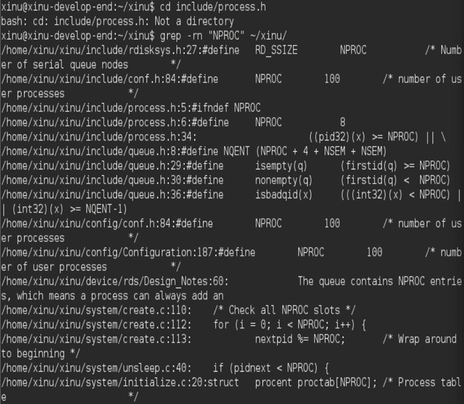
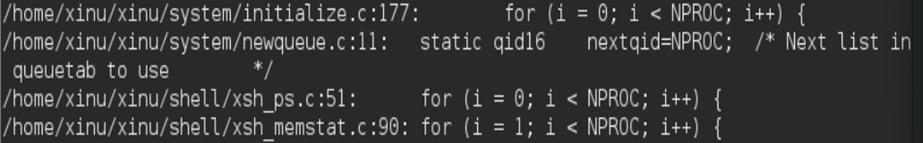
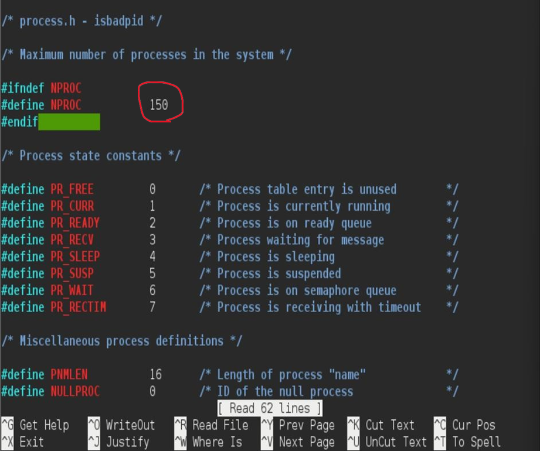
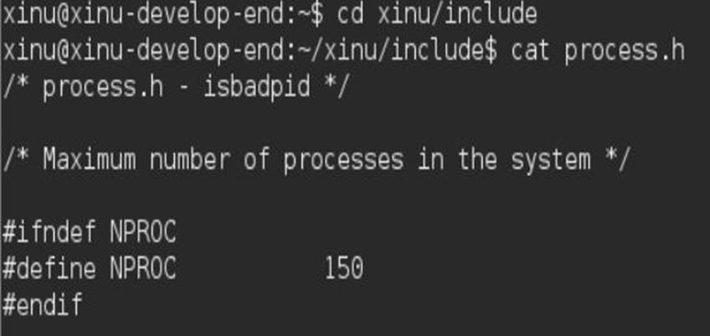

# <h1 align="center">Laporan Praktikum Modul 5   Explorasi Proses</h1>

EDUARDO BAGUS PRIMA JULIAN - 2311104025

## Dasar Teori

Instalasi Oracle VM VirtualBox dan Sourcetrail, import backend dan development system ke Virtual Box lalu coba running

## Guided

 MODUL 6

1. [10 Poin] Selain hardware (memory), batasan maksimal proses dapat ditentukan dengan secara software. Pada Linux maksimal proses adalah 4194303 proses (64 bit) dan 32767 proses (32 bit) dapat dilihat melalui perintah : $cat /proc/sys/kernel/pid_max

Carilah pada source code Xinu yang memberi batasan mengenai banyaknya proses yang bisa dibuat! Berapa maksimal proses dalam Xinu? Ubah menjadi maksimal 150 proses!

2. [20 Poin] Jalankan kode sekuensial! 

## Referensi

1. trust me bro