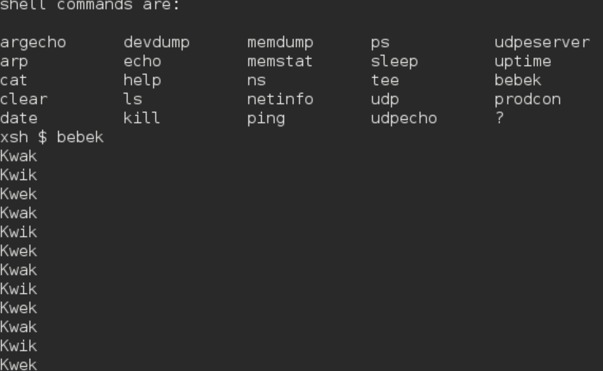
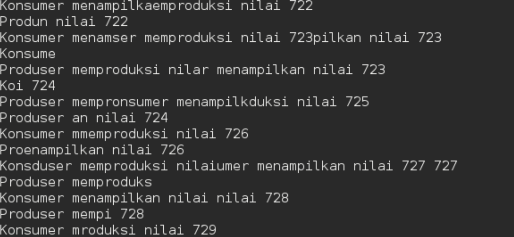

# <h1 align="center">Laporan Praktikum Modul 7   Semaphore</h1>

EDUARDO BAGUS PRIMA JULIAN - 2311104025

## Dasar Teori

Semaphore adalah mekanisme sinkronisasi dalam sistem operasi yang digunakan untuk mengatur akses beberapa proses atau thread terhadap sumber daya bersama (shared resource). Konsep semaphore pertama kali diperkenalkan oleh Edsger W. Dijkstra pada tahun 1965 untuk mengatasi masalah race condition pada sistem yang menjalankan banyak proses secara bersamaan.

## Guided

 MODUL 7

## Referensi

1. trust me bro