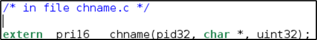
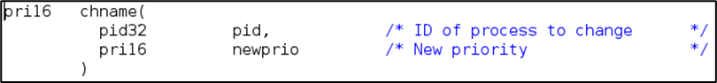
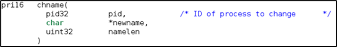
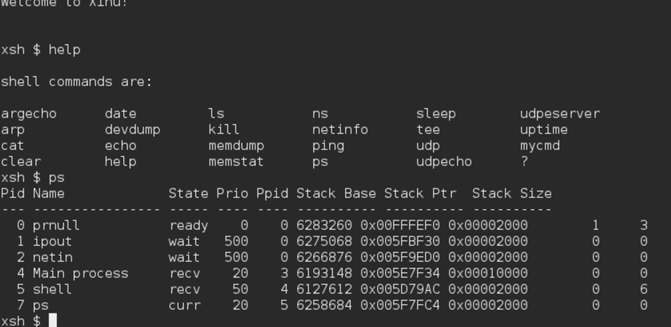
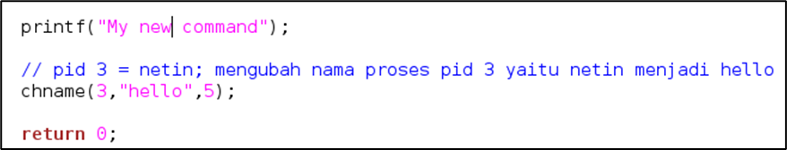
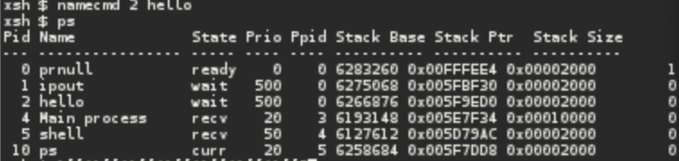

# <h1 align="center">Laporan Praktikum Modul 10   Shell</h1>

EDUARDO BAGUS PRIMA JULIAN - 2311104025

## Dasar Teori

Shell adalah program yang berfungsi sebagai penghubung antara pengguna dengan sistem operasi, khususnya kernel pada sistem operasi seperti Linux dan UNIX. Shell menerima perintah dari pengguna, kemudian menerjemahkan dan mengeksekusinya agar dapat diproses oleh sistem operasi.

## Guided

 MODUL 10
Jurnal
1.	[40 Poin] Akan dimodifikasi shell dengan modifikasi syscall bernama chname yang berfungsi untuk mengubah nama suatu proses. Lihat kembali modul sebelumnya cara membuat syscall. 

Perhatikan sekarang syscall chname mempunyai 3 parameter yaitu pid, character dan panjang character. Character untuk menyimpan nama dan panjang character untuk panjang nama.

a.	Pada prototypes.h chname diubah menjadi:

b.	Pada chname.c fungsi diubah dari:
 
menjadi
 

Modifikasi kode pada chname.c sehingga nama proses bisa diubah bila syscall tersebut dipanggil.
Jawab:
 

2.	[40 Poin] Buatlah perintah baru bernama namecmd sesuai dengan langkah-langkah pada no.5 pada modul shell!
Berikut adalah kode dalam perintah baru namecmd:
 
	Jawab:
 

3.	[20 Poin] Test hasilnya: 
a.	Masuk ke terminal xinu
b.	Jalankan perintah ps
c.	Jalankan perintah namecmd
d.	Jalankan perintah ps
e.	Lihat nama proses telah berubah
Jawab:
 

## Referensi

1. trust me bro