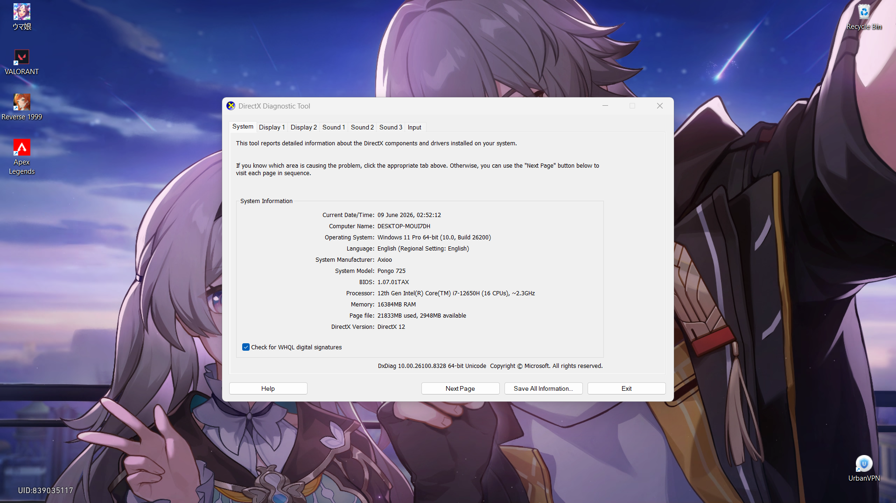

# <h1 align="center">Laporan Praktikum Modul 12   Linux dan Windows</h1>

Eduardo Bagus Prima Julian - 2311104025

## Dasar Teori

Sistem operasi adalah komponen perangkat lunak dari sebuah sistem komputer yang bertanggung 
jawab untuk mengatur dan mengkoordinasikan aktivitas-aktivitas dan pembagian resource komputer. 
Sistem operasi bertindak sebagai host dari program aplikasi yang berjalan di mesin. Sistem operasi 
menawarkan berbagai service bagi program aplikasi dan pengguna. Aplikasi mengakses service ini 
melalui application programming interfaces (APIs) atau system calls. Dengan menggunakan interface
ini, aplikasi dapat meminta service dari sistem operasi, melewatkan parameter, dan menerima hasil 
dari suatu operasi.

## Guided

Mempelajari instalasi windows 10 dan penggunaan ubuntu dalam VM.

## Jurnal

1. [10 Poin] Jelaskan dengan bahasa sendiri, apa itu Sistem Operasi?
= Sistem operasi adalah perangkat lunak utama yang berfungsi untuk mengatur dan mengelola seluruh sumber daya pada komputer, seperti processor, memori, hard disk, perangkat input/output, serta menjalankan aplikasi yang digunakan pengguna. Sistem operasi juga menjadi penghubung antara pengguna dengan perangkat keras komputer sehingga komputer dapat digunakan dengan mudah.

2. [25 Poin] Buka dxdiag pada kolom search windows, dan jawab pertanyaan berikut!
[5 Poin] Sertakan Screenshot!

a. [5 Poin] Windows apakah yang diinstal? 
= 11
b. [5 Poin] Berapa bit Windows yang diinstall?
= 64
c. [5 Poin] Berapa kecepatan processor yang digunakan?
= Processor Intel Core i7-12650H dengan kecepatan sekitar 2.3 GHz.
d. [5 Poin] Grafik yang digunakan versi berapa? Apakah sudah sesuai dengan
spesifikasi rekomendasi pada modul?
= Menggunakan DirectX 12 dan sudah sesuai dengan spesifikasi rekomendasi pada modul.

3. [10 Poin] Apa kelebihan dari windows yang terpasang sekarang? Sebutkan versi
berapa windows terbaru saat ini!
= Kelebihan Windows yang terpasang sekarang antara lain:
    Memiliki tampilan antarmuka yang mudah digunakan.
    Mendukung banyak aplikasi dan software.
    Kompatibel dengan berbagai perangkat keras.
    Memiliki fitur keamanan yang lebih baik.
    Mendukung update sistem secara berkala. 
Versi Windows terbaru saat ini adalah Windows 11.

4. [25 Poin] Buka virtualbox, dan jawab pertanyaan berikut!
[5 Poin] Sertakan Screenshot!
a. [5 Poin] Linux apakah yang diinstall?
= Ubuntu Linux.
b. [5 Poin] Berapa bit Linux yang diinstall?
= 64
c. [5 Poin] Berapa ukuran hard disk virtual mesin?
= 25
d. [5 Poin] Terdapat berapa buah partisi pada hard disk?
= 2

5. [10 Poin] Linux memiliki berbagai jenis, sebutkan 5 jenis linux distro!
= ubuntu, mint, manjuro, debian, fedora.

6. [10 Poin] Anda sudah mengenal dan menggunakan 3 jenis sistem operasi pada
praktikum ini, sebutkan sistem operasi tersebut!
= Windows, Linux, Android

7. [10 Poin] Setelah mengenal 3 jenis sistem operasi tersebut, menurut Anda sistem
operasi mana yang lebih mudah digunakan? Jelaskan argumentasi Anda!
= Menurut saya, sistem operasi yang paling mudah digunakan adalah Windows karena memiliki tampilan yang sederhana dan mudah dipahami oleh pengguna pemula. Selain itu, Windows juga mendukung banyak aplikasi yang sering digunakan untuk belajar, bekerja, maupun hiburan. Driver perangkat keras juga umumnya otomatis terdeteksi sehingga pengguna tidak perlu melakukan konfigurasi yang rumit. Oleh karena itu, Windows lebih nyaman digunakan dalam kegiatan sehari-hari.

## Referensi
trust me bro