# <h1 align="center">Laporan Praktikum Modul 13   Perintah Dasar Linux</h1>

Eduardo Bagus Prima Julian - 2311104025

## Dasar Teori

Windows dan Linux merupakan sistem operasi yang berfungsi mengatur perangkat keras dan perangkat lunak pada komputer agar dapat digunakan oleh pengguna. Windows dikembangkan oleh Microsoft dengan antarmuka yang mudah digunakan dan kompatibel dengan banyak aplikasi umum. Sementara itu, Linux adalah sistem operasi open-source yang dikembangkan dari kernel Linux dan memiliki berbagai distro seperti Ubuntu, Debian, dan Fedora, dengan keunggulan pada stabilitas, keamanan, serta fleksibilitas penggunaannya.

## Guided

1.  a. Jalankan dan screenshot terminal Anda! 
    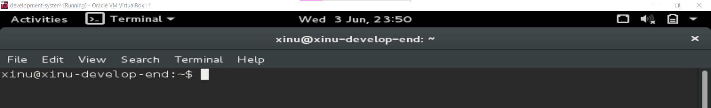  
    b. Jelaskan arti dari command prompt milik Anda!  
    - xinu = username pengguna  
    - xinu-develop-end = hostname/ nama komputer  
    - ~ = direktori home user  
    - $ = menandakan pengguna biasa (bukan root)  
2.  a. Jalankan dan screenshot perintah berikut ini: ls  
    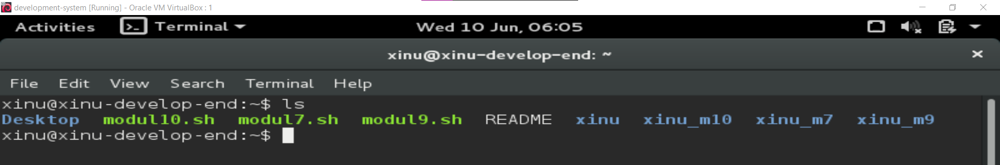  
    b. Apakah option dan parameter dari perintah di atas?  
    Tidak ada option ataupun parameter di perintah atas.  
    c. Apa fungsi dari perintah tersebut?  
    Perintah tersebut berfungsi untuk menampilkan daftar file dan folder pada direktori saat ini.  
    d. Jalankan perintah berikut ini: ls -al /  
    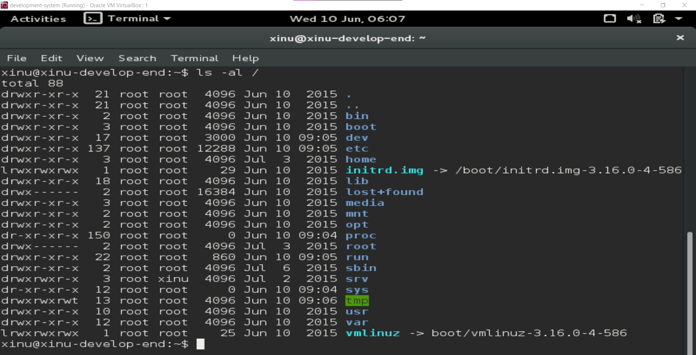  
    e. Apakah option dan parameter dari perintah di atas?  
    - Option: -a = menampilkan file tersembunyi, dan -l = menampilkan detail file.  
    - Parameter: / yang artinya direktori root  

    f. Apa fungsi dari perintah tersebut?  
    Menampilkan seluruh file dan folder pada direktori root secara detail termasuk dengan file tersembunyi.  
    g. Jelaskan mengapa perintah pada a dan e mempunyai hasil yang berbeda!  
    Karena ls hanya menampilkan isi direktori secara biasa dan ls -al / menampilkan isi direktori root secara lengkap dan detail termasuk dengan file tersembunyi  

3.  a. Jalankan dan screenshot perintah: pwd  
    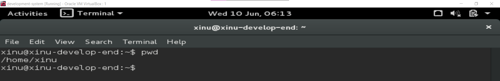  
    b. Apakah option dan parameter dari perintah tersebut?
    - Option: tidak ada
    - Parameter: tidak ada

    c. Apa fungsi perintah tersebut?  
    Menampilkan lokasi direktori kerja saat ini  

4.  a. Jalankan dan screenshot perintah: cd /  
    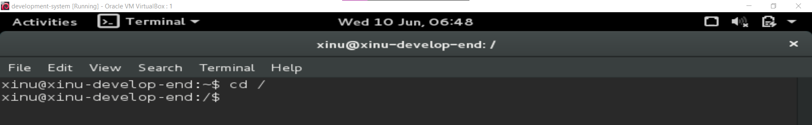
    b. Apakah option dan parameter dari perintah tersebut?  
    - Option: tidak ada
    - Parameter: / = direktori root

    c. Apa yang dilakukan perintah tersebut?  
    Berpindah ke direktori root Linux.

5.  a. Lakukan dan screenshot perintah cd / kemudian lakukan perintah cd ~. Jelaskan
    hasil dari keduanya!
    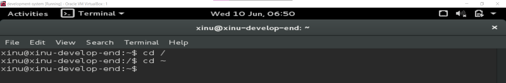  
    Penjelasan: cd / berfungsi untuk berpindah ke direktori root dan cd ~ berfungsi untuk berpindah ke home directory user.  
    b. Lakukan perintah cd /proc/self. Buatlah perintah menggunakan cd .. agar dapat
    berpindah ke direktori / (root). Berapa kali perintah cd .. harus dieksekusi?
    Screenshot hasilnya!  
    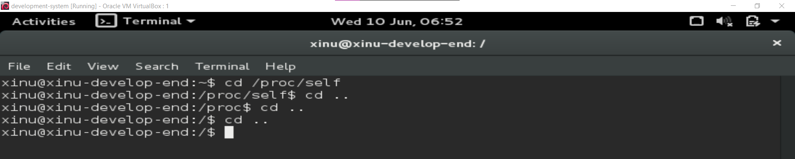  
    Penjelasan: untuk kembali ke root / dari /proc/self dibutuhkan 2 kali perintah cd .. untuk dieksekusi.  

6.  a. Copylah file dari /proc/cpuinfo ke folder home Anda (/home/user/) menggunakan
    command pada terminal. Ganti user dengan username anda.  
    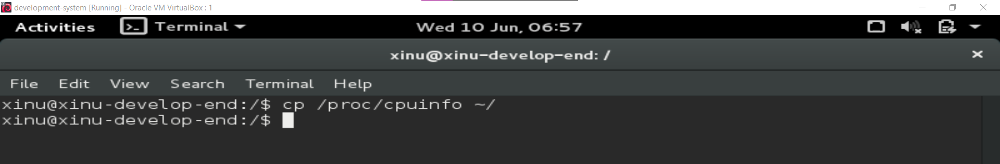  
    b. Tunjukkan menggunakan perintah bahwa file tersebut benar-benar telah dicopy ke
    folder home Anda.  
    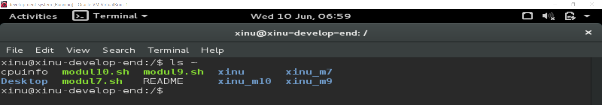  
    c. Copy file dari /proc/uptime ke folder home Anda.  
    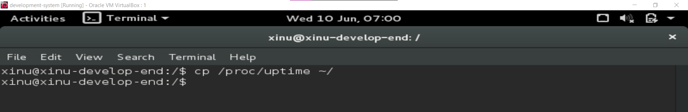  
    d. Tunjukkan menggunakan perintah bahwa file tersebut benar-benar telah dicopy ke
    folder home Anda.  
    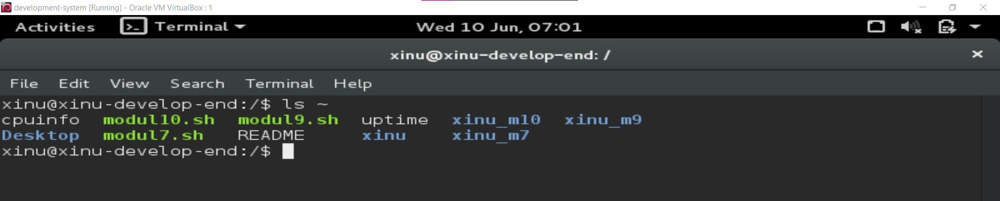  
    e. Hapuslah file uptime di folder home Anda.  
    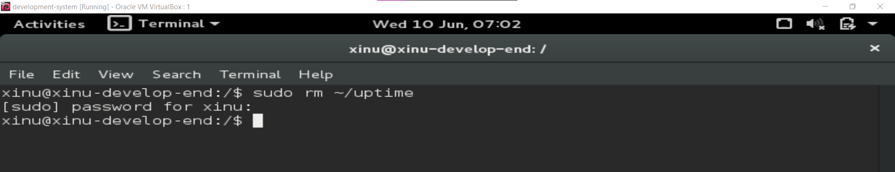  
    f. Tunjukkan menggunakan perintah bahwa file tersebut benar-benar telah dihapus ke
    folder home Anda.  
    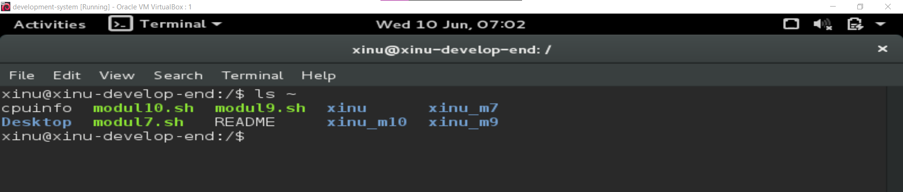  
    g. Rename file cpuinfo di folder home Anda menjadi infocpu  
    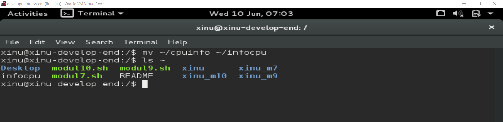  

7.  a. Buatlah folder baru dengan nama “nim_anda”.  
    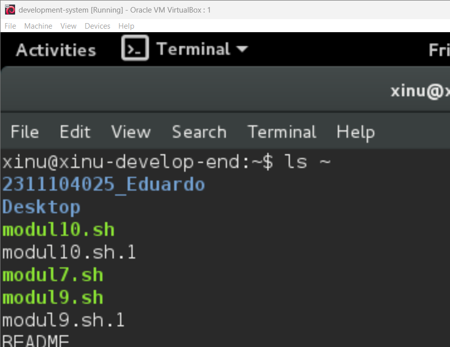  
    b. Buatlah di dalam folder “nim_anda”, folder baru dengan nama “nama_anda”.  
    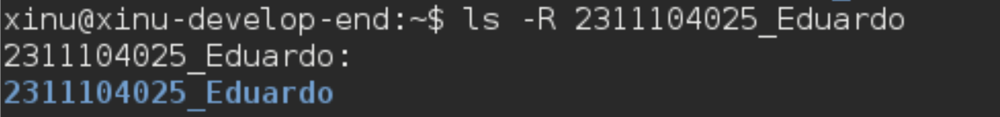  

8.  a. Bukalah fungsi manual untuk perintah “ls”  
    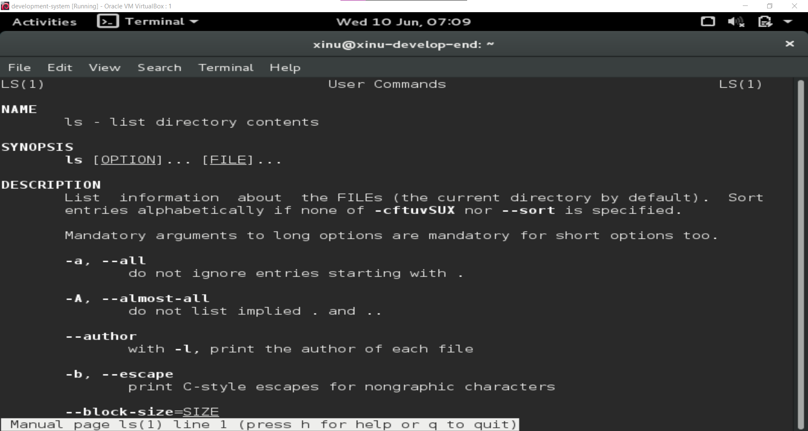  
    b. Apa fungsi perintah “ls”?  
    Menampilkan isi direktori.  
    c. Siapakah pencipta perintah “ls”?  
    Richard M. Stallman dan David MacKenzie.  
    d. Apakah arti dari -h dari manual ls?  
    Menampilkan ukuran file dalam format mudah dibaca manusia (KB, MB, GB).  
    e. Option apa yang harus digunakan agar dapat melihat direktori secara rekursif?  
    -R  
    f. Bukalah fungsi manual untuk perintah “cp”  
    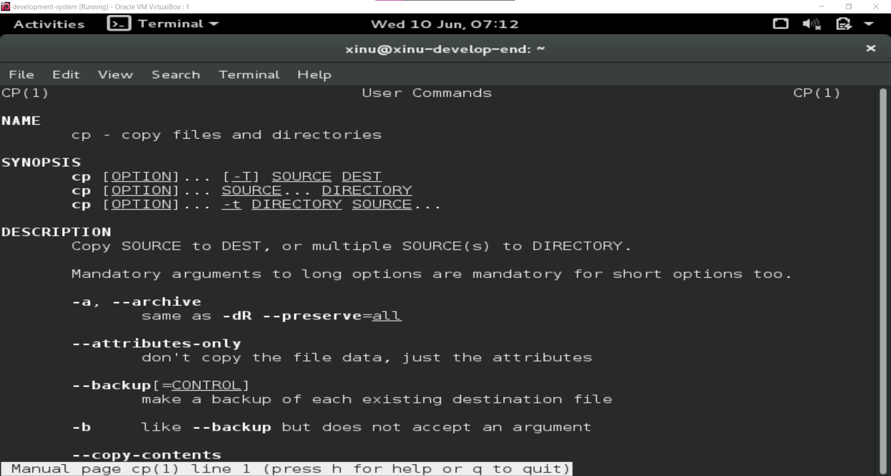  
    g. Apa fungsi perintah “cp”  
    Menyalin file atau folder.  
    h. Siapakah pencipta perintah “cp”?  
    Torbjorn Granlund, David MacKenzie, dan Jim Meyering.  
    i. Apakah arti -v dalam perintah “cp?  
    Verbose yang mana menampilkan proses penyalinan file.  
    j. Jika ingin interaktif, option apa yang harus digunakan?  
    -i  

9.  a. Lakukan perintah ini cat /etc/passwd dan screenshot hasil perintah tersebut!  
    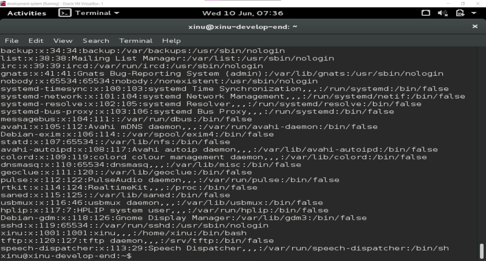  
    b. Apa fungsi perintah cat?  
    Untuk menampilkan isi file.  
    c. Lakukan perintah cat /etc/passwd | grep daemon dan screenshot hasil perintah
    tersebut!  
    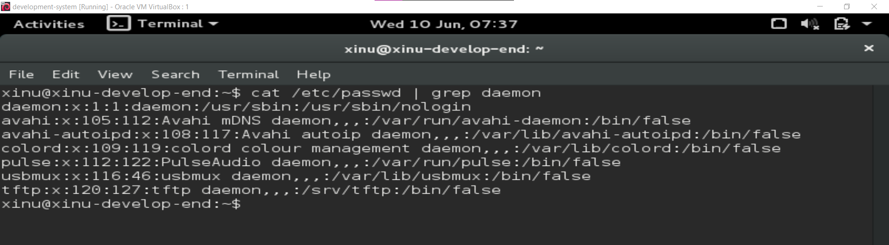  
    d. Lakukan perintah cat /etc/passwd | grep root dan screenshot hasil perintah tersebut!  
    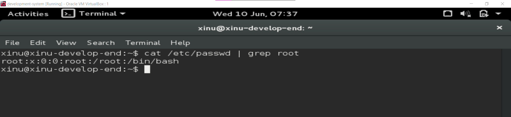  
    e. Lakukan perintah cat /etc/passwd | grep nobody dan screenshot hasil perintah  
    tersebut!  
    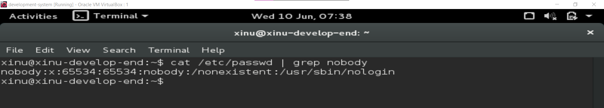  
    f. Apakah fungsi perintah “ | grep daemon”?  
    - | = pipe, untuk mengirim output ke perintah berikutnya.
    - grep daemon untuk mencari kata "daemon"

10. a. Lakukan perintah dan jelaskan hasilnya  
    cd /  
    ls -al > /home/user/result.txt  
    Ganti user dengan username ubuntu anda.  
    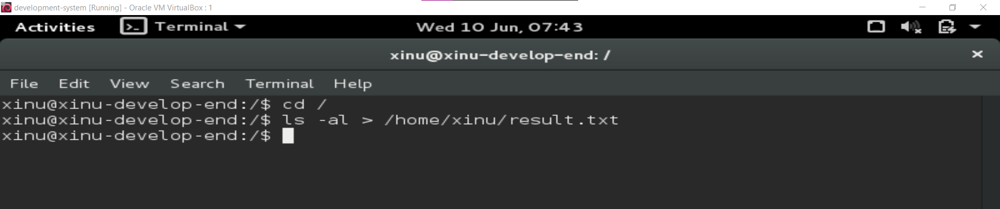  
    b. Dimana file result.txt berada?  
    File ada di /home/xinu/result.txt  
    c. Lakukan perintah dan jelaskan hasilnya
    cd /etc  
    ls -al > /home/user/result.txt  
    Ganti user dengan username ubuntu anda.  
    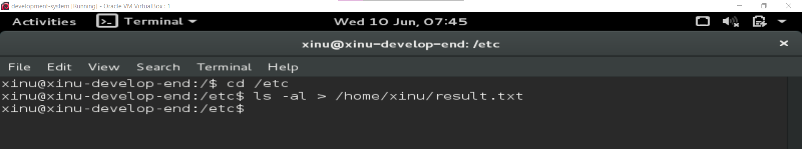  
    d. Apakah fungsi dari perintah >?  
    Menyimpan output ke file dan menyimpan isi file sebelumnya.  
    e. Lakukan perintah dan jelaskan hasilnya cd /  
    ls -al >> /home/user/result1.txt  
    Ganti user dengan username ubuntu anda.  
    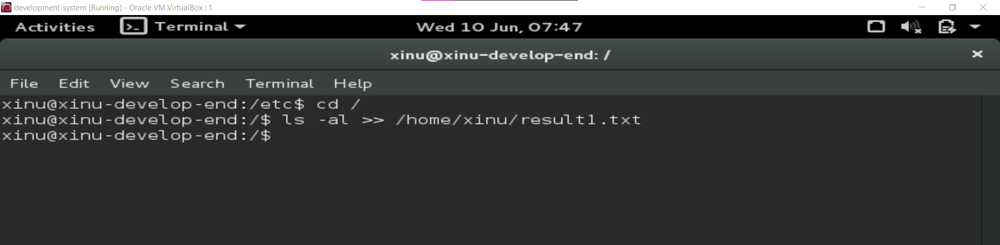  
    f. Lakukan perintah dan jelaskan hasilnya  
    cd /etc  
    ls -al >> /home/user/result1.txt  
    Ganti user dengan username ubuntu anda.  
    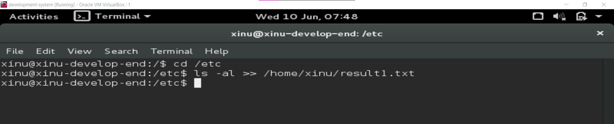  
    g. Apakah perbedaan perintah > dan >>?  
    - ">" = overwrite/ menimpa isi file  
    - ">>" = append/ menambahkan isi file  

## Referensi

trust me bro