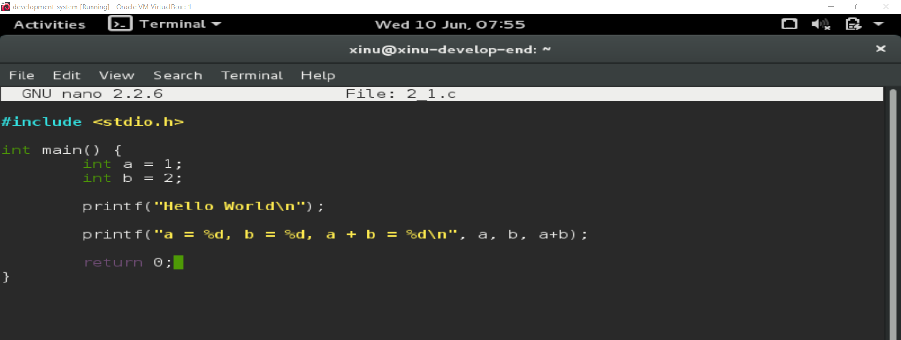
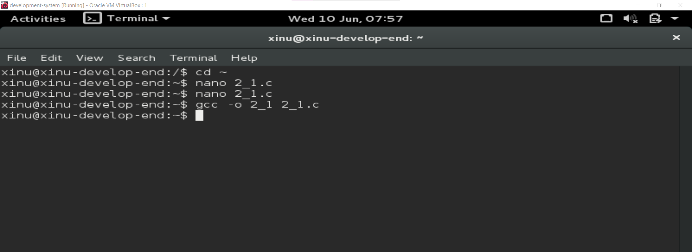
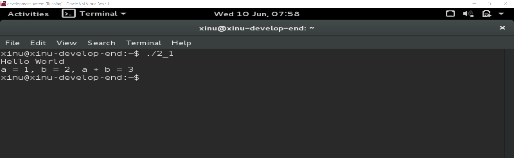
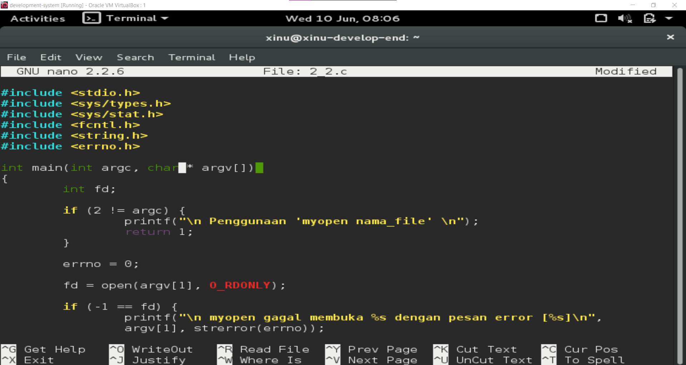
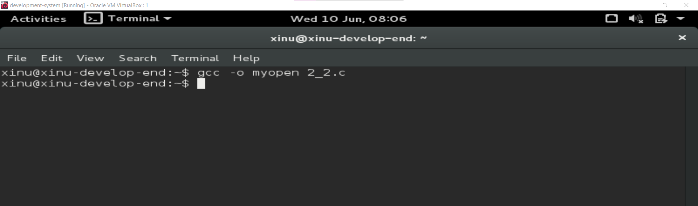
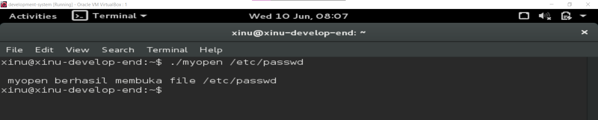

# <h1 align="center">Laporan Praktikum Modul 13   Perintah Dasar Linux</h1>

Eduardo Bagus Prima Julian - 2311104025

## Dasar Teori

Windows dan Linux merupakan sistem operasi yang berfungsi mengatur perangkat keras dan perangkat lunak pada komputer agar dapat digunakan oleh pengguna. Windows dikembangkan oleh Microsoft dengan antarmuka yang mudah digunakan dan kompatibel dengan banyak aplikasi umum. Sementara itu, Linux adalah sistem operasi open-source yang dikembangkan dari kernel Linux dan memiliki berbagai distro seperti Ubuntu, Debian, dan Fedora, dengan keunggulan pada stabilitas, keamanan, serta fleksibilitas penggunaannya.

## Guided

1.  Buatlah file dengan nama 2_1.c yang berisi:
    
2.  Kompile source code tersebut menggunakan gcc! Nama output program adalah 2_1
    (bukan a.out). Tuliskan perintah untuk mengkompile source code tersebut!
    
3.  Jalankan program yang baru saja Anda kompile. Tuliskan perintah untuk menjalankan
    program tersebut!
    
4.  Buatlah file dengan nama 2_2.c yang berisi:
    
5.  Kompile source code tersebut menggunakan gcc! Nama output program adalah
    “myopen”. Tulis perintah untuk mengkompile source code tersebut.
    
6.  Jalankan program myopen yang baru saja Anda buat! Tuliskan perintah untuk
    menjalankan program myopen.
    
7.  Jelaskan apa yang dilakukan program tersebut!  
    Program myopen digunakan untuk membuka file secara read-only menggunakan fungsi open().
    - Jika file berhasil dibuka maka muncul pesan berhasil
    - Jika gagal muncul pesan error

    Program juga menggunakan strerror(errno) untuk menampilkan penyebab error.

## Referensi

trust me bro