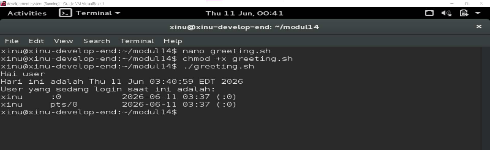
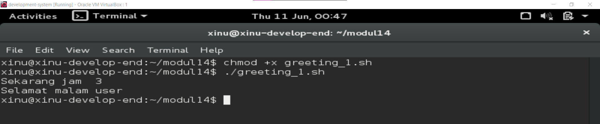
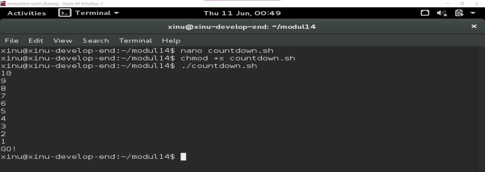
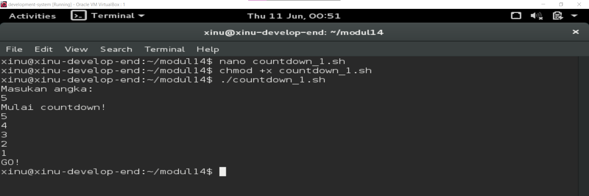
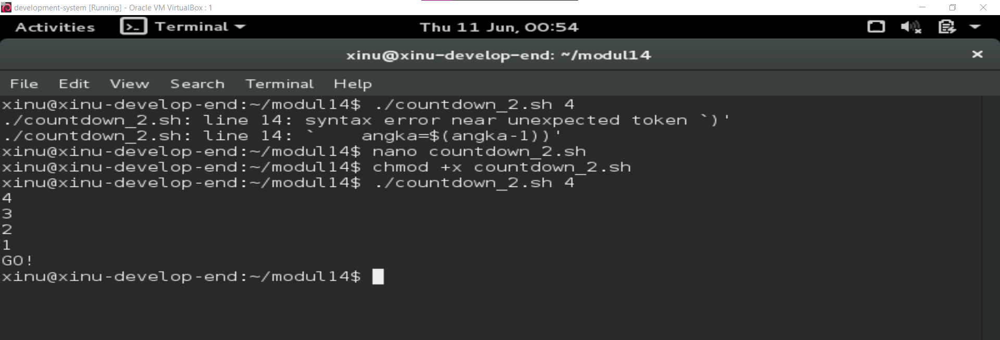
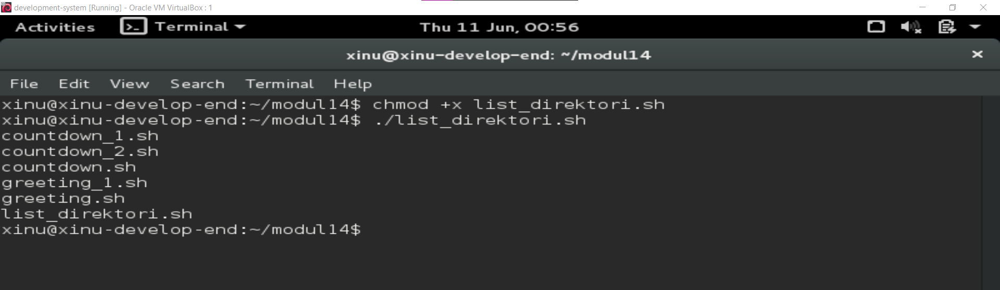

# <h1 align="center">Laporan Praktikum Modul 14   Scripting </h1>

Eduardo Bagus Prima Julian - 2311104025

## Dasar Teori

Windows dan Linux merupakan sistem operasi yang berfungsi mengatur perangkat keras dan perangkat lunak pada komputer agar dapat digunakan oleh pengguna. Windows dikembangkan oleh Microsoft dengan antarmuka yang mudah digunakan dan kompatibel dengan banyak aplikasi umum. Sementara itu, Linux adalah sistem operasi open-source yang dikembangkan dari kernel Linux dan memiliki berbagai distro seperti Ubuntu, Debian, dan Fedora, dengan keunggulan pada stabilitas, keamanan, serta fleksibilitas penggunaannya.

## Guided

1. a. Buatlah file bernama greeting.sh sesuai dengan template code.  
   b. Buatlah script pada greeting.sh sehingga:  
   - Dapat menyapa user  
   - Menampilkan tanggal hari ini  
   - Menampilkan user yang sedang login saat ini  
     

2. a. Buatlah file bernama greeting_1.sh sesuai dengan template code.  
   b. Buatlah script pada greeting_1.sh sehingga dapat menampilkan “selamat pagi” pada
   pagi hari (05:01-10:00), “selamat siang” pada siang hari (10:01-15:00), “selamat sore”
   pada sore hari (15:01-19:00) “selamat malam” pada malam hari (19:01-05:00).  
   

3. a. Buatlah file bernama countdown.sh sesuai dengan template code.  
   b. Buatlah script sehingga menghasilkan countdown dimulai dari angka 10 hingga angka
   1 lalu diikuti tulisan “GO!”.  
   

4. a. Buatlah file bernama countdown_1.sh sesuai dengan template code.  
   b. Buatlah script sehingga menghasilkan countdown berdasarkan masukan dari user.  
   

5. a. Buatlah file bernama countdown_2.sh sesuai dengan template code.  
   b. Buatlah script sehingga menghasilkan countdown berdasarkan parameter script.
   Pastikan kondisi-kondisi lain ditangani.  
   

6. a. Buatlah file bernama list_direktori.sh. Jangan lupa untuk mengubah ijin script
   sehingga dapat dieksekusi.  
   b. Buatlah script sehingga menampilkan semua file pada direktori tersebut.  
   

## Referensi

trust me bro