# <h1 align="center">Laporan Praktikum Modul 15   Keamanan Linux </h1>

Eduardo Bagus Prima Julian - 2311104025

## Dasar Teori

Windows dan Linux merupakan sistem operasi yang berfungsi mengatur perangkat keras dan perangkat lunak pada komputer agar dapat digunakan oleh pengguna. Windows dikembangkan oleh Microsoft dengan antarmuka yang mudah digunakan dan kompatibel dengan banyak aplikasi umum. Sementara itu, Linux adalah sistem operasi open-source yang dikembangkan dari kernel Linux dan memiliki berbagai distro seperti Ubuntu, Debian, dan Fedora, dengan keunggulan pada stabilitas, keamanan, serta fleksibilitas penggunaannya.

## Guided

1. Integritas: dasar hashing [10 Point]  
   a. [2 Point] Lakukan hash SHA256, SHA512 dan MD5 untuk file /etc/passwd. Berapa nilai
   hash dari file /etc/passwd? Screenshot nilai hash dari file tersebut.  
   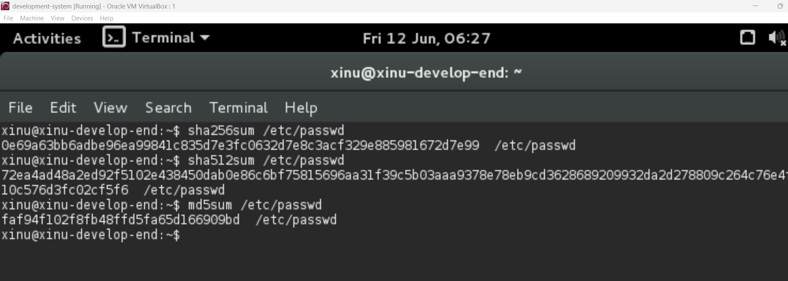
   b. [2 Point] Buatlah file bernama test_0.txt pada folder /home/praktikan. Isi file tersebut isi
   yang ada di file /etc/passwd (copy paste isi file /etc/passwd ke test_0.txt)  
   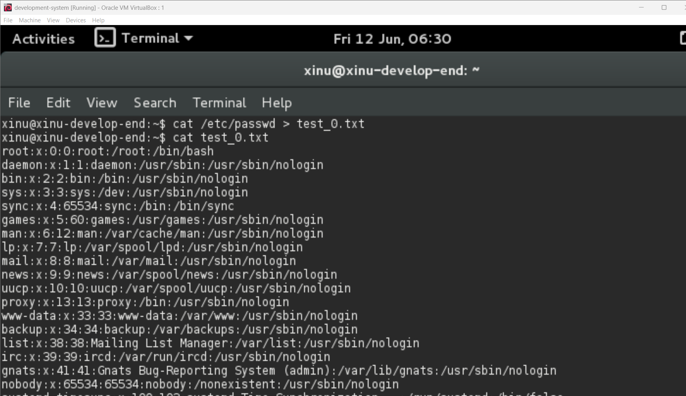
   c. [2 Point] Lakukan hash SHA256, SHA512 dan MD5 untuk file test_0.txt. Berapa nilai
   hash dari file test_0.txt? Screenshot nilai hash dari file test_0.txt.  
   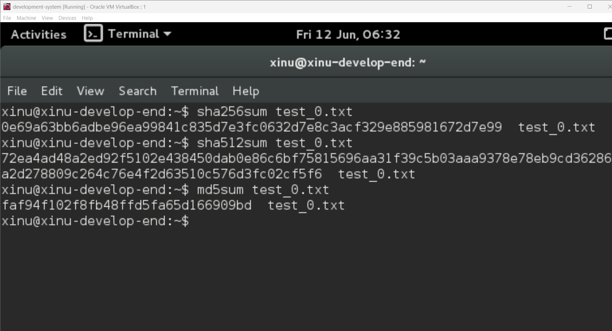
   d. [2 Point] Rename file test_0.txt menjadi file_0.txt. Lakukan hash SHA256, SHA512 dan
   MD5 untuk file_0.txt. Berapa nilai hash file_0.txt? Screenshot nilai hash dari file_0.txt.  
   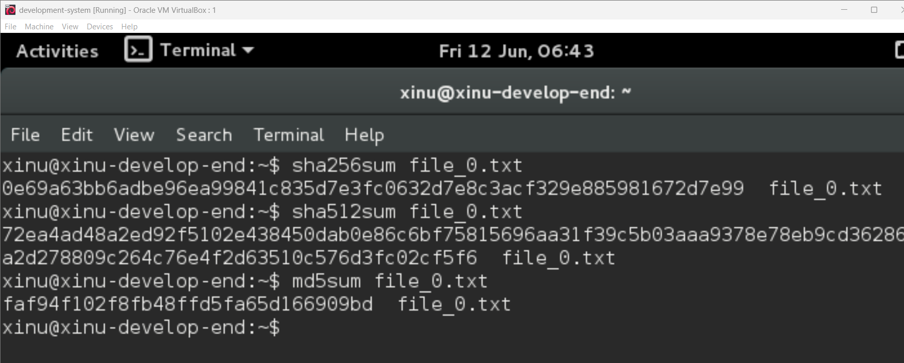
   e. [2 Point] Apa hasil pengamatan Anda? File apa saja yang mempunyai hash yang sama?
   Jelaskan!  
   Hash dari file tersebut sama. Alasannya karena Hash dihitung berdasarkan isi file, rename file hanya mengubah nama file, isi file tidak berubah sehingga hash tetap sama.  

2. Integritas: avalance [15 Point]  
   a. [3 Point] Download file bernama test_1.txt di link ini tiny.cc/test1_txt  
   b. [3 Point] Lakukan hash SHA256, SHA512 dan MD5 untuk file test_1.txt. Berapa nilai
   hash test_1.txt? Screenshot nilai hash dari file test_1.txt.  
   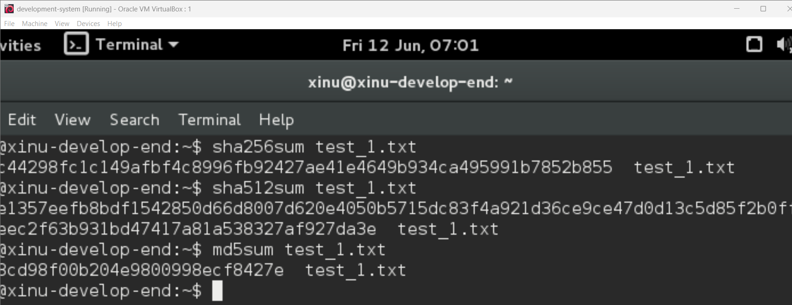
   c. [3 Point] Hapuslah titik diakhir file test_1.txt tersebut, simpan file tersebut!  
   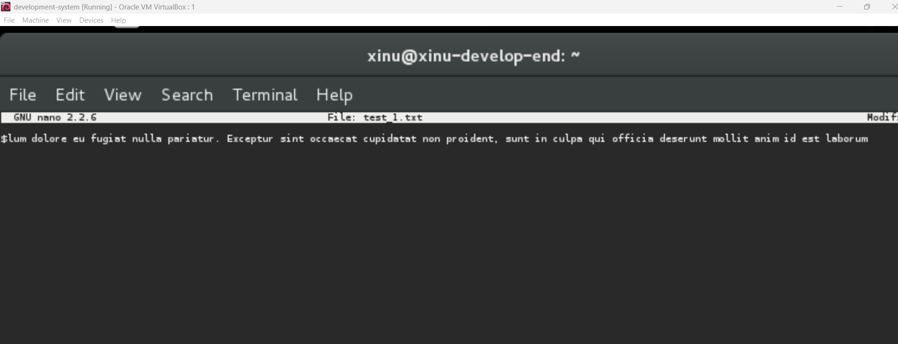
   d. [3 Point] Lakukan hash dari SHA256, SHA512 dan MD5. Screenshot nilai hash dari file
   test_1.txt.  
   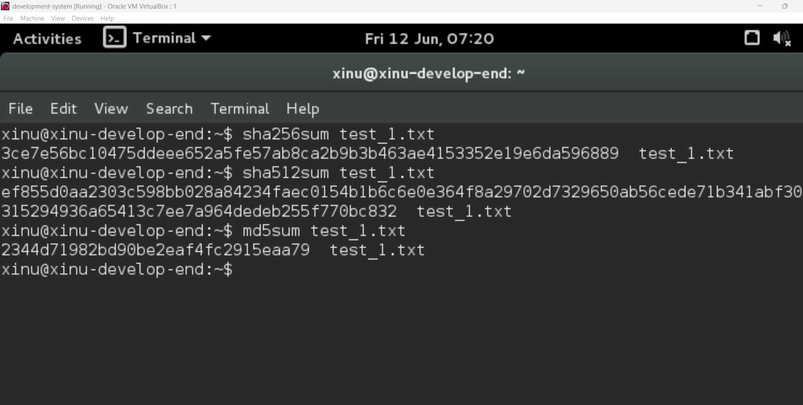
   e. [3 Point] Apa analisis (hasil pengamatan) Anda mengenai hal tersebut! Apakah nilai hash
   sama?  
   Nilai hash berbeda karena salah satu penghapusan satu karakter.  

3. Integritas: metadata [18 Point]  
   a. [3 Point] Download file bernama test_1.doc di link ini tiny.cc/test1_doc  
   b. [3 Point] Lakukan hash SHA256, SHA512 dan MD5 untuk file test_1.doc. Screenshot nilai
   hash dari file test_1.doc.  
   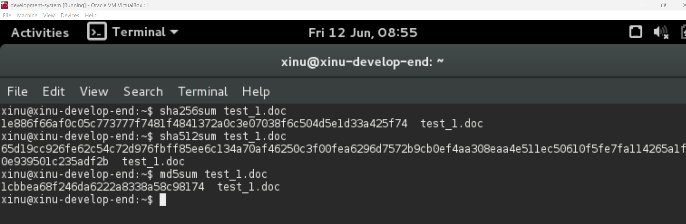
   c. Buka kembali file test_1.doc. Lakukan hal ini:  
   - [3 Point] Ketik abcdef. Save test_1.doc
   - [3 Point] Hapus abcdef. Save test_1.doc

   d.[3 Point] Lakukan hash SHA256, SHA512 dan MD5 untuk file test_1.doc. Screenshot nilai
   hash dari file test_1.doc.  
   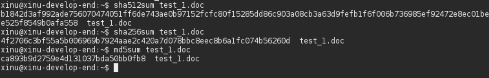
   e. [3 Point] Hasil pengamatan apa yang diperoleh? Jelaskan alasannya!  
   Nilai hash berubah meskipun isi dokumen kembali seperti semula. Ini dikarenakan file dokumen menyimpan metadata.  

4. Konfidensialitas: encfs [27 Point]  
   Encfs adalah tool untuk melakukan mount dan membuat file system yang terenkripsi. Cara kerjanya
   adalah sebagai berikut. Ada 2 folder yang akan dibuat, dua folder tersebut saling terkait. Satu folder
   merupakan folder yang tidak terenkripsi, folder lainnya merupakan hasil enkripsi dari folder
   pertama.  
   WARNING: INSTALL ENCFS!  
   sudo apt-get update  
   sudo apt-get -y install encfs  
   Setelah terinstall silakan melanjutkan pengerjaan jurnal.  
   a. [5 Point] Jalankan perintah berikut:  
   encfs ~/folder_anda/folder_terenkripsi ~/folder_anda/folder_normal
   Pilih y (enter), pilih y (enter), enter, kemudian buatlah password. Ingatlah password yang
   dibuat. Setelah selesai, perhatikan bahwa telah muncul folder bernama folder_normal dan
   folder_terenkripsi.  
   
   b. [5 Point] Copy dua atau tiga buah file (file apa saja) ke folder_normal. Amati dan tulis
   hasil observasi Anda pada folder_terenkripsi!  
  
   Nama file menjadi acak dan terenkripsi.  
   c. [5 Point] Hapus salah satu file (bebas) pada folder_terenkripsi. Amati dan tulis hasil
   observasi Anda pada folder_normal!  

   File yang dihapus di salah satu folder akan terhapus juga di folder lain karena kedua folder tersebut terhubung.  
   d. [5 Point] Lakukan umount dengan perintah:
   Fusermount -u ~/folder_anda/folder_normal
   Amati dan tulis hasil observasi Anda pada folder_normal dan folder_terenkripsi  
   
   folder_normal menjadi kosong/tidak dapat diakses isi file aslinya. Sedangkan folder_terenkripsi masih berisi filde terenkripsi.  
   e. [7 Point] Buatlah folder baru bernama folder_sembarang. Lakukan perintah berikut ini:
   encfs ~/folder_anda/folder_terenkripsi ~/folder_anda/folder_sembarang
   Amati dan tulis hasil observasi Anda!  
   
   Semua file asli muncul kembali di folder_sembarang. Ini menunjukan bahwa data terenkripsi data dibuka kembali dengan password yang benar.  

5. Konfidensialitas: gpg [30 Point]  
   a. [5 Point] Membuat kunci publik dan privat. Jalankan perintah ini:
   gpg --gen-key
   Baca dan ikuti perintah yang ada dari program gpg!  
   b. [5 Point] Hasil publickey dan privatekey ada di folder ~/.gnupg. Privatekey tidak boleh
   keluar dari komputer ini dan hanya Anda saja yang dapat mengaksesnya. Kunci publik
   akan dibagikan kepada seluruh dunia atau untuk orang yang Anda inginkan saja. Kunci
   publik adalah pubring.gpg dan kunci private adalah secring.gpg
   Lakukan perintah berikut ini untuk mengetahui daftar key yang Anda punya dan fingerprint
   kunci yang Anda punya!  
   gpg –-list-keys  
   gpg –-fingerprint nama@email.com  
   Screenshot hasil perintah di atas!  
   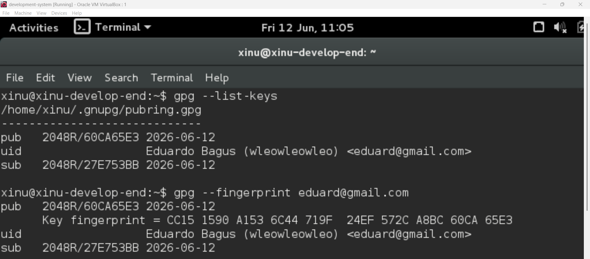
   c. [5 Point] Export kunci publik Anda. Jalankan perintah ini:  
   gpg –-armor –-export nama@email.anda > mypublic_key.asc  
   File mypublic_key.asc adalah file yang akan dibagikan kepada teman-teman Anda.
   Teman Anda akan menggunakan kunci publik Anda jika ingin mengirim pesan rahasia
   kepada Anda. Hanya Anda yang dapat membaca pesan tersebut karena hanya mempunyai
   kunci privat yang bersesuaian dengan kunci publik Anda.  
   - Rename mypublic_key.asc menjadi nim_anda.asc, Contoh: 130118xxxx.asc  
   - Taruh file nim_anda.asc ke folder pada link berikut: http://tiny.cc/SisopNomor5C  
   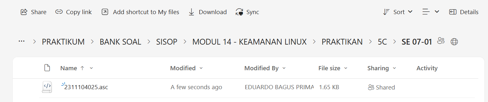

   d. [5 Point] Mengimport kunci publik orang lain. Silakan download file
   nim_teman_sebelah_anda.asc dan jalankan perintah ini untuk mengimport (menambahkan
   kunci publik orang lain ke sistem Anda):  
   gpg –-import nim_teman_sebelah_anda.asc  
   Contoh: “gpg --import 130118yyyy.asc” Setelah mengimport kunci publik teman Anda,
   Anda dapat mengirimkan pesan kepada teman Anda secara terenkripsi.
   Untuk memastikan bahwa kunci publik telah diimport lakukan perintah  
   gpg –-list-keys  
   dan nama teman Anda ada pada hasil perintah tersebut.  
   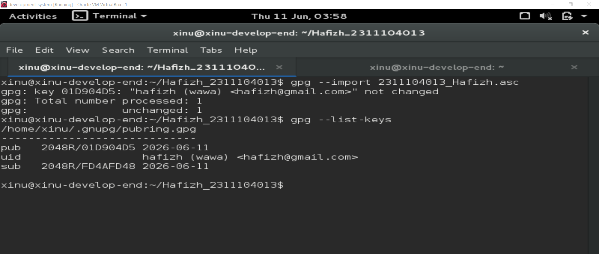
   e. [5 Point] Enkripsi pesan. Buatlah file bernama file_rahasia.txt. Isi file tersebut dengan
   pesan rahasia Anda. Pesan inilah yang akan Anda kirim ke teman Anda. Jalankan
   perintah ini untuk melakukan enkripsi:  
   //ditulis dalam satu baris  
   gpg –-encrypt –-armor -r  
   alamat_email_teman_anda_yang_baru_diimport@xxx.com file_rahasia.txt <bbr>
   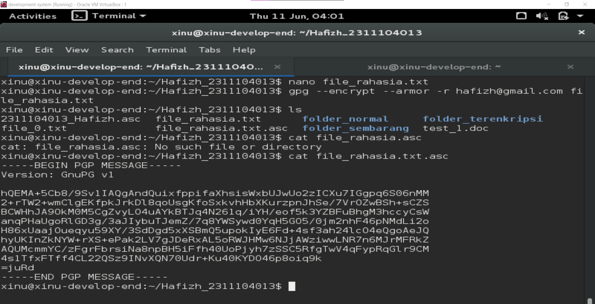
   f. [5 Point] Hanya teman anda yang dapat membuka file tersebut. Hasil dari proses tersebut
   adalah file_rahasia_untuk_teman_anda.asc (contoh: file_rahasia_untuk_130118yyyy.asc)
   Taruh file_rahasia_untuk_teman_anda.asc ke folder pada link:  
   http://tiny.cc/SisopNomor5F  
   Download dan buka file yang diperuntukkan bagi Anda dan lakukan dekripsi untuk
   melihat isi pesan dengan perintah:  
   gpg file_rahasia_nim_anda.asc  
   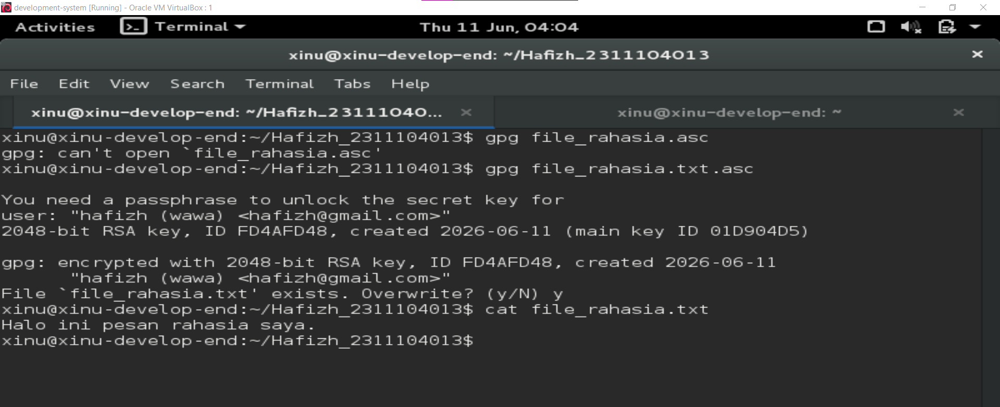

## Referensi

trust me bro